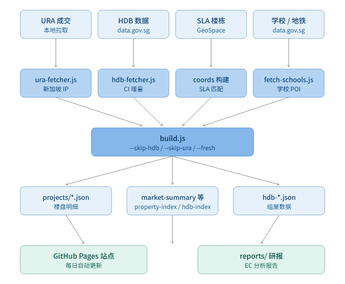
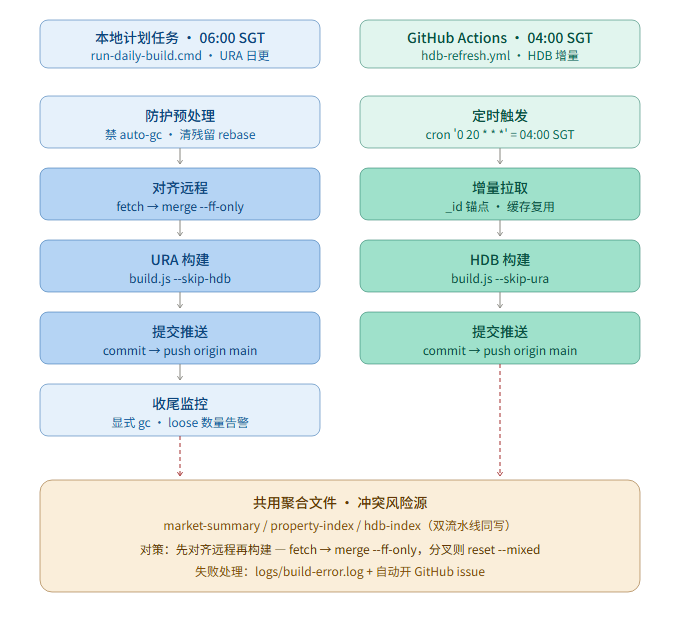

# SG Property Dashboard

新加坡房产数据看板。每日自动从 URA、HDB data.gov.sg、SLA GeoSpace 等数据源拉取并构建，发布为静态站点。

- 在线预览：https://kindle0088-sys.github.io/sg-property/
- 报告发布仓库：kindle0088-sys/sg-property
- 数据仓库：当前项目（property-dashboard）

---

## 一、数据管道架构

下图展示了从数据源到前端展示的完整管道。



五层结构：

| 层 | 内容 | 说明 |
|----|------|------|
| 数据源 | URA 成交、HDB data.gov.sg、SLA GeoSpace、学校/地铁 | 海外拉取受限，URA 仅本地 |
| 采集脚本 | ura-fetcher / hdb-fetcher | 每个脚本对应一个数据源 |
| 构建 | `scripts/build.js` | 参数：`--skip-hdb` / `--skip-ura` / `--fresh` |
| 产物 | projects/\*.json、market-summary、property-index、hdb-index | 聚合 JSON，供前端直接消费 |
| 展示 | GitHub Pages 静态站点 + reports/ 研报 | 每日自动发布 |

---

## 二、每日自动化时序

项目由两条流水线协同维护，互不阻塞但共享聚合文件，所以设计时考虑了冲突对策。



### 流水线 A：本地计划任务 · 每月 16 日 09:00 SGT

脚本：`run-all.mjs`（node 编排），由 Windows 任务计划程序直接执行 `node.exe run-all.mjs`。

> URA 私宅数据为**月度发布**（每月 15 号前后），故本地任务改为月更。HDB 由 CI（流水线 B）日更，本脚本只跑 URA（`--skip-hdb`）。
>
> 2026-08-15 起由 cmd 迁移到 node：原 cmd 版在计划任务环境有三坑（PATH 无 git、stdout 管道阻塞、cmd 语法笨拙），node 版用绝对路径 + `spawnSync` 捕获输出全部绕开。

1. **防护预处理**：禁 `git auto-gc`、清除残留 rebase 状态
2. **对齐远程**：`git fetch origin` → `merge --ff-only FETCH_HEAD`（分叉则 `reset --mixed`，数据由本次构建重新生成）。注意：不用 `origin/main`——本机对 git 写 `refs/remotes/origin/*` loose ref 存在静默拦截（update-ref 返回 0 但文件不落地），`FETCH_HEAD` 是 fetch 直接产物，不依赖 remote-tracking ref
3. **URA 构建**：`node build.js --skip-hdb`
4. **提交推送**：`git add data/ .github/` → 仅真实变更才 `commit` → `push origin main`
5. **收尾监控**：显式 `git gc --quiet` + `fsck --connectivity-only` 校验，loose objects 超 6700 告警

失败处理：写 `logs/build-error.log`，自动开 GitHub issue（避免重复告警）。

### 流水线 B：GitHub Actions · 04:00 SGT

工作流：`.github/workflows/hdb-refresh.yml`，`cron: '0 20 * * *'` UTC = 新加坡时间 04:00。

1. **定时触发**：每日 04:00 SGT
2. **增量拉取**：`_id` 锚点增量，缓存 `data/hdb_cache`
3. **HDB 构建**：`node build.js --skip-ura`
4. **提交推送**：仅 `data/hdb*`、`property-index` 等真实变更才提交

手动全量刷新：`.github/workflows/hdb-full-refresh-manual.yml`，`workflow_dispatch` 触发，`build.js --fresh --skip-ura`。

### 冲突风险与对策

两条流水线都向 `data/market-summary.json`、`data/property-index.json`、`data/hdb-index.json` 这三个聚合文件写入内容。如果按时间顺序串行执行（比如本地 06:00 + CI 04:00），HDB 改动可能领先；本地先 commit 后 rebase 会冲突，且脚本不检查 pull errorlevel → 冲突残留 → 后续构建在 detached HEAD 上 commit，数据永远推不上去。

对策已固化在 `run-all.mjs`：**先 fetch → merge --ff-only → 才构建**。这样构建一定是基于最新 main，所有 push 不会出现非 fast-forward。

---

## 三、关键命令速查

```bash
# 本地全量构建（拉取全部 HDB + URA）
node scripts/build.js --fresh

# 本地日常构建（跳过 HDB，仅 URA）
node scripts/build.js --skip-hdb

# CI 风格构建（跳过 URA，仅 HDB）
node scripts/build.js --skip-ura
```

---

## 四、目录结构

```
property-dashboard/
├── index.html          # 入口页面
├── js/                 # 前端模块
├── css/                # 样式
├── data/               # 数据（构建产物）
│   ├── projects/       # 各楼盘明细 JSON
│   ├── hdb*/           # HDB 数据与索引
│   ├── market-summary.json
│   ├── property-index.json
│   └── projects-index.json
├── scripts/            # Node.js 数据采集与构建脚本
│   ├── build.js        # 主构建入口
│   ├── ura-fetcher.js  # URA 数据采集
│   ├── hdb-fetcher.js  # HDB 增量采集
│   └── ...
├── reports/            # EC 研报（独立发布到 sg-property）
├── logs/               # 每日构建日志（不提交）
├── .github/workflows/  # CI 配置
├── run-all.mjs         # 本地月更编排脚本（node，计划任务直跑）
└── docs/               # 文档与图表
    ├── architecture.svg
    ├── architecture.png
    ├── automation-flow.svg
    ├── automation-flow.png
    └── architecture.html
```

---

## 五、查看图表

打开 `docs/architecture.html` 可在一页内浏览两张图（架构图 + 自动化时序图）。

PNG/SVG 单独查看：
- `docs/architecture.png` / `architecture.svg`
- `docs/automation-flow.png` / `automation-flow.svg`